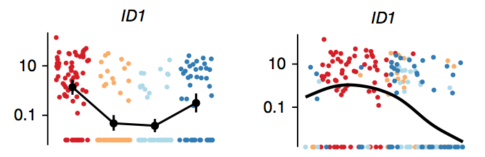
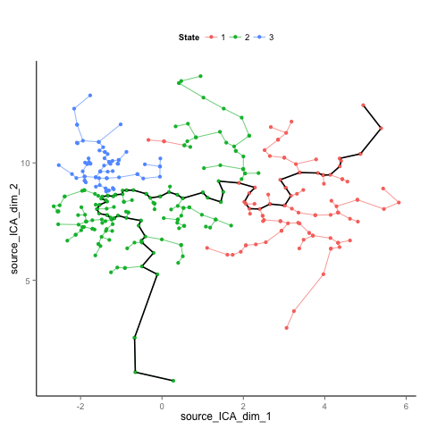
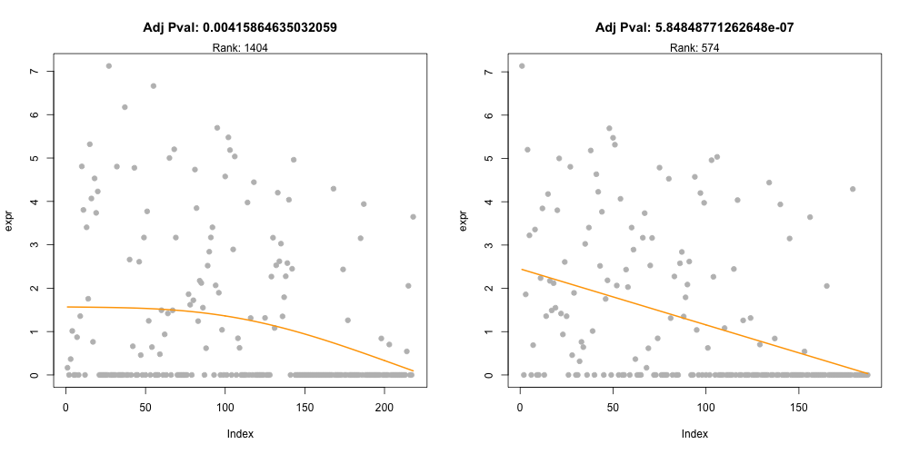
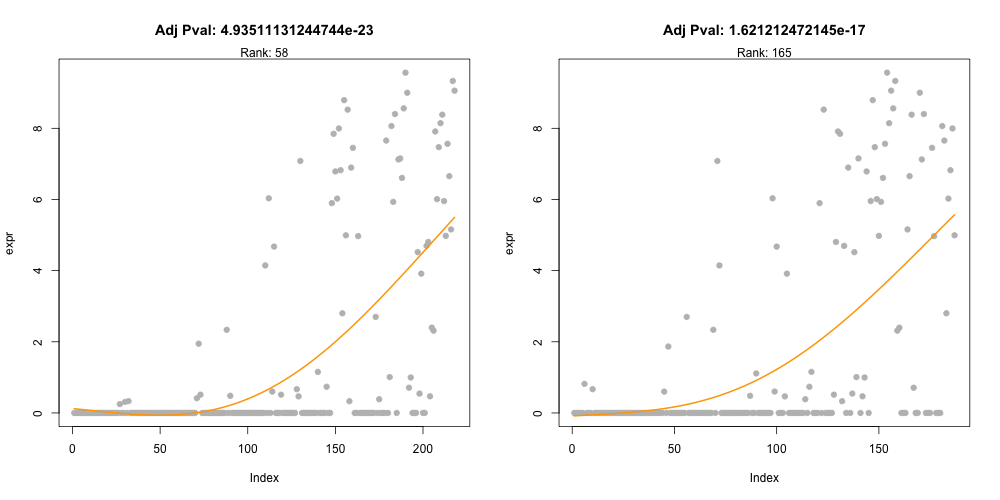
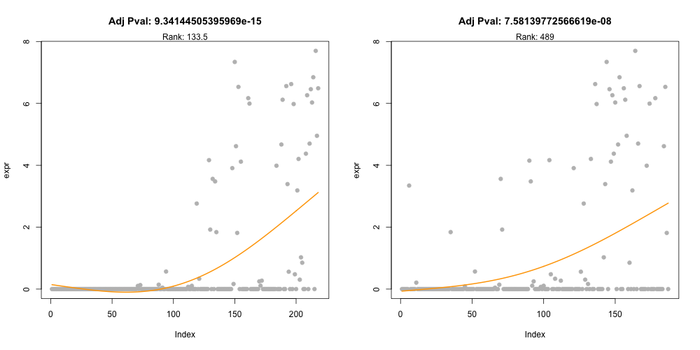
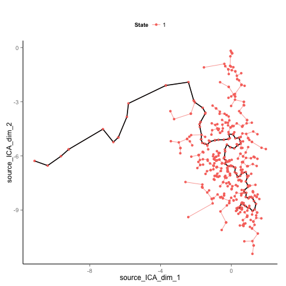
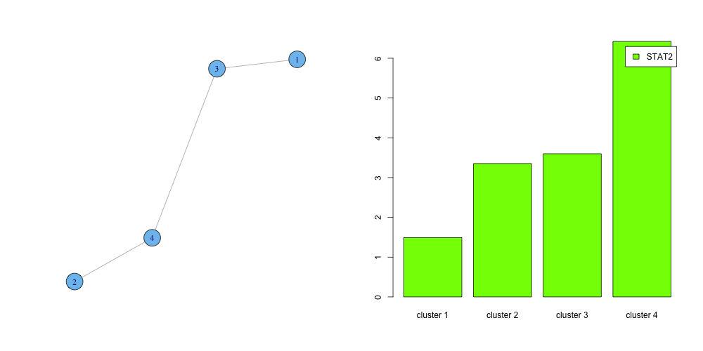
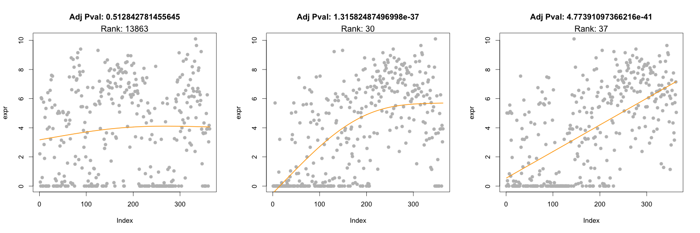
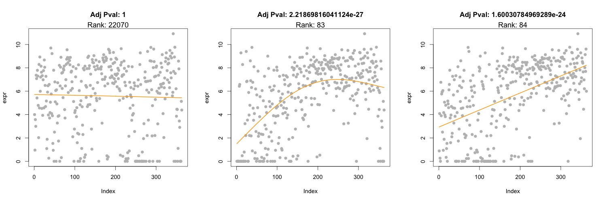
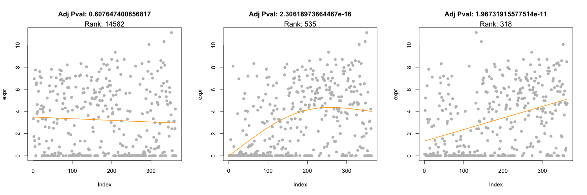

## Introductions

Single-cell RNA-seq is a powerful approach to investigate the heterogeneity of gene expression activities on cell level, which is otherwise hard to detect by bulk transcriptomics experiments.

---

## Introductions

Advantages of Single-cell RNA-seq compared to bulk RNA-seq:

Avoid potential Simpson's paradox:

---

## Introductions

Advantages of Single-cell RNA-seq compared to bulk RNA-seq:

Increase temporal resolution:

---

## Introductions

Many single-cell RNA-seq data involve a continuous biological process, which requires computational methods to realign the cells to a pseudotime scale.

Current computational approaches:

* SPADES: unsupervised spanning-tree progression approach to organize cells in a hierarchy of related phenotypes when applied to flow cytometry data.

* Monocle: unsupervised approach to order single cells by constructing a minimum-spanning-tree. Capable of finding different trajectories of biological process. 

---

## Introductions

Disadvantages of current methods:

* Unsupervised methods cannot incorporate prior biological knowledge (e.g. expressions of marker genes).

* Users have limited options to tune the pseudotemporal orderings.

* No quantitative methods to evaluate different pseudotemporal orderings.

---

## Introductions

TSCAN, a novel method \& software package to address these problems:

* Can switch from unsupervised to supervised method to incorporate prior biological knowledge.

* Plenty of options for users to conveniently tune the pseudotemporal orderings.

* POS: quantitative methods to evaluate pseudotemporal orderings.

---

## Software Package

TSCAN is already available on Bioconductor:

http://www.bioconductor.org/packages/devel/bioc/html/TSCAN.html

TSCAN GUI can be directly launched on:

https://zhiji.shinyapps.io/TSCAN

---

## Datasets

* Human skeletal muscle myoblasts (HSMM): 4 time points; 271 cells; 47192 genes

* Mouse LPS stimulation (pathogen): 5 time points; 363 cells; 27723 genes

---

## POS

Pseudotemporal Ordering Score: quantitatively measure different pseudotemporal orderings.

Requires prior knowledge of at least two cell sub-populations.

Cells collected at later time points should also be assigned to a later position on pseudotime course.

Definition:

$\frac{\sum_{i,j:\pi(i) \prec \pi(j)} (T_j-T_i)}{N_1*N_2}$

---

## TSCAN Methods

1. Add pseudocount 1 and take log2 of data.

2. Select key genes: expression greater than 0.5 in at least 30% of all cells. CV in non-dropout cell greater than the median CV. (HSMM: 3989 genes; LPS: 2892 genes)

3. Perform principal component analysis with selected optimal dimension.

4. Multivariate normal clustering using the data after PCA.

5. Connect all cluster centers with minimum-spanning-tree.

6. Assign all points on the time course by projections.

---

## HSMM Results

Monocle :

---

## HSMM Results

MST after mclust:

---

## HSMM Results

Monocle POS: 0.4457489

TSCAN POS: 0.5268724

---

## HSMM Results

CDK1:

---

## HSMM Results

ID1:

---

## HSMM Results

MYOG:

---

## HSMM Results

MEF2C:

---

## HSMM Results

MYH2:

---

## LPS Results

Monocle :

---

## LPS Results

MST after mclust:

---

## LPS Results

Monocle POS: 0.4279521

TSCAN POS: 0.7135031

TSCAN STAT2 adjusted POS: 0.7620408	

---

## LPS Results

STAT1:

---

## LPS Results

STAT2:

---

## LPS Results

NFKB1:

---

## LPS Results

IRF9:

---

## Future work

* TSCAN 2.0: Tools for time course Single-Cell RNA-seq data

* TSCAN 2.1: Tools for differential gene expression in Single-Cell RNA-seq data

* TSCAN 3.0: Tools for alternative splicing analysis in Single-Cell RNA-seq data

* GSCA 2.0: Similarity and time course analysis for PED

--- .segue .dark

Thank you!
-----

