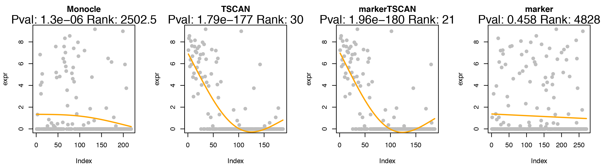
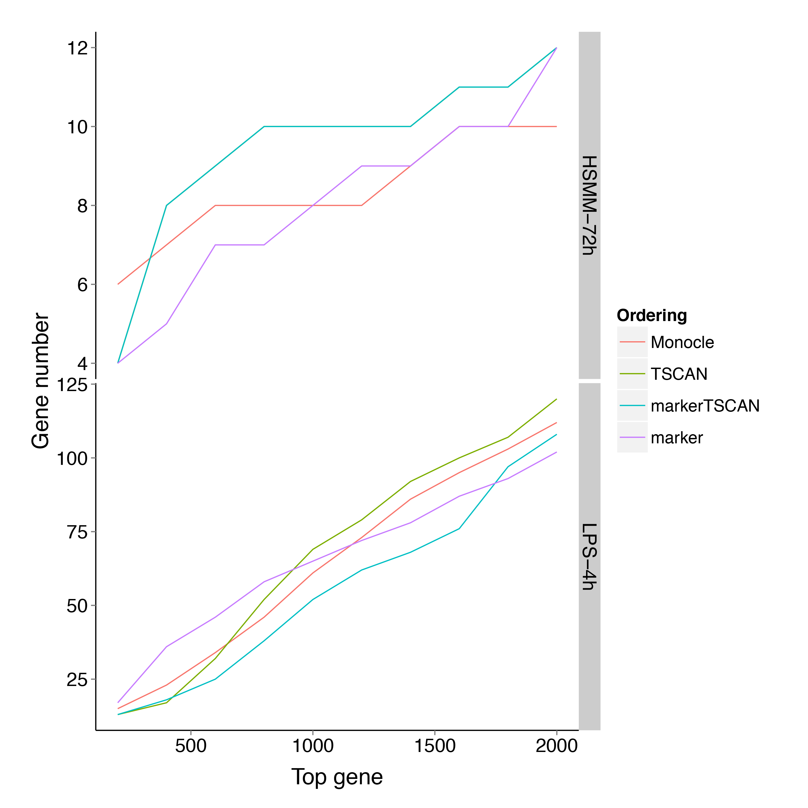

## Introductions

Single-cell RNA-seq is a powerful technology to investigate the heterogeneity of gene expressions on cell level, which is otherwise hard to detect by bulk RNA-seq.

---

## Introductions

Single-cell RNA-seq can avoid potential Simpson's paradox and increase temporal resolution:

---

## Introductions

Many single-cell RNA-seq data involve continuous biological processes. 

In differentiation process, some cells differentiate faster than the others even though they are collected at the same time point.

An artificial order of cells need to be constructed to reflect the gradual change of the transcriptome among different cells.

Monocle: unsupervised approach to construct pseudo time cell order using minimum-spanning-tree.

---

## Introductions

Source: Trapnell, C., et al. (2014). The dynamics and regulators of cell fate decisions are revealed by pseudotemporal ordering of single cells. Nature biotechnology.

---

## Introductions

Disadvantages of current methods:

* Unsupervised methods cannot incorporate prior biological knowledge (e.g. expressions of marker genes).

* Users have limited options to tune the pseudo time orderings.

* No quantitative methods to evaluate different pseudo time orderings.

---

## Introductions

TSCAN, a novel method \& software package:

* Can switch from unsupervised to supervised strategy to incorporate prior biological knowledge.

* Plenty of options for users to conveniently tune the pseudo time orderings.

* POS: quantitative methods to evaluate different pseudo time orderings.

---

## TSCAN Methods

1. Perform principal component analysis.
2. Model-based clustering.
3. Connect all cluster centers with minimum-spanning-tree.
4. Project all points on the backbone path and form pseudo time ordering.

---

## POS

Pseudo time Ordering Score: quantitatively measure different pseudo time orderings.

Requires prior knowledge of at least two cell sub-populations.

Cells collected at later time points should be assigned to later positions on pseudo time axis.

Definition for two cell sub-population case:

$\frac{\sum_{i,j:\pi(i) \prec \pi(j)} (T_j-T_i)}{N_1*N_2}$

---

## Results

Testing datasets:

* Human skeletal muscle myoblasts: 4 time points; 271 cells; 47192 genes; marker: CKM

* Mouse LPS stimulation: 5 time points; 363 cells; 27723 genes; marker: BCL3

* Mouse ES-MEF: 2 time pints; 92 cells; 21711 genes; marker: Sox2

Methods compared:

* Monocle

* Unsupervised TSCAN

* Supervised TSCAN (with marker gene information)

* Marker gene

---

## POS

---

## HSMM CDK1 gene

---

## LPS STAT1 gene

---

## ESMEF Pou5f1 gene

---

## Differential gene analysis

Key GO terms:

HSMM: skeletal muscle cell differentiation (GO:0035914)

LPS: immune response (GO:0006955)

ES-MEF: embryo development (GO:0009790)

---

## Single time point

---

## Software Package

TSCAN is already available on Bioconductor:

http://bioconductor.org/packages/release/bioc/html/TSCAN.html

TSCAN GUI can be directly launched on:

https://zhiji.shinyapps.io/TSCAN

---

## Demo

--- .segue .dark

Thank you!
-----

